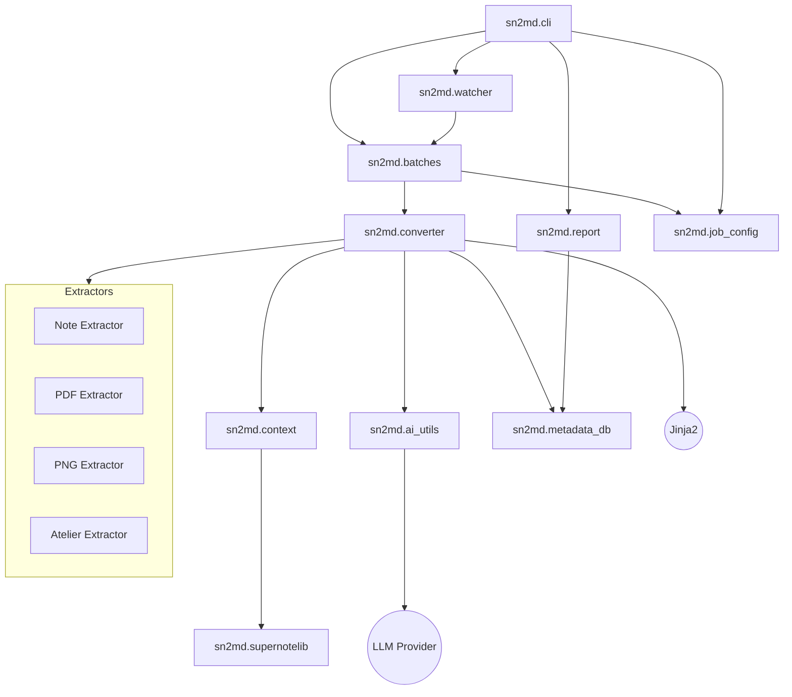
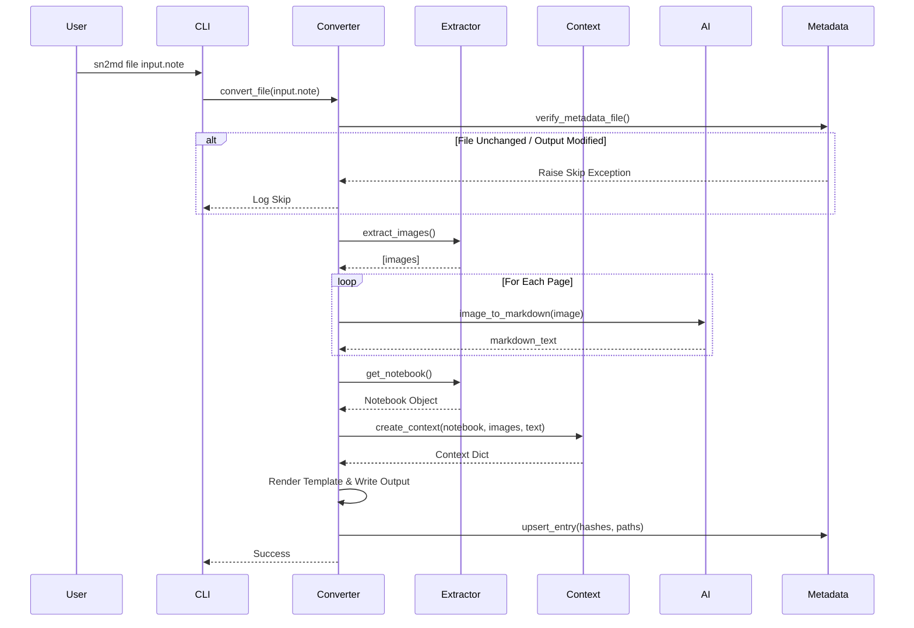
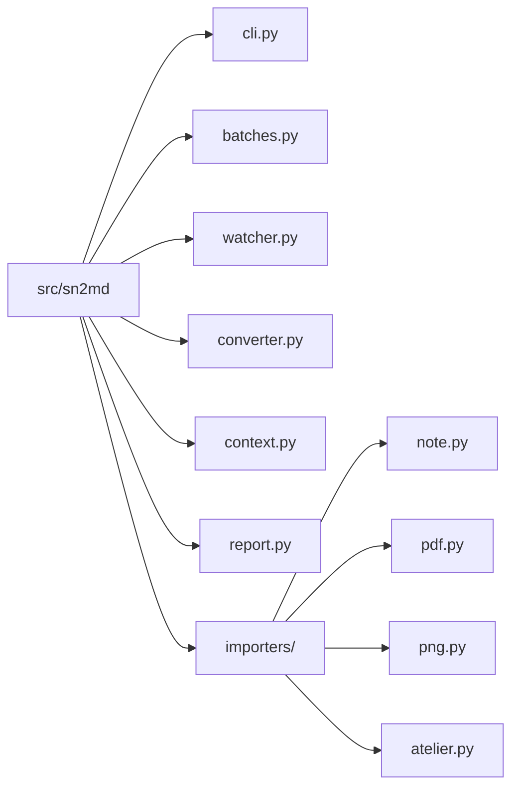

# Application Architecture

This document maps the `sn2md` application structure and data flow using Mermaid diagrams.

## Module Dependency Graph

This diagram shows how the internal modules interact with each other.

## Conversion Flow (Sequence)

This diagram illustrates the process of converting a single file.

## Directory Structure

